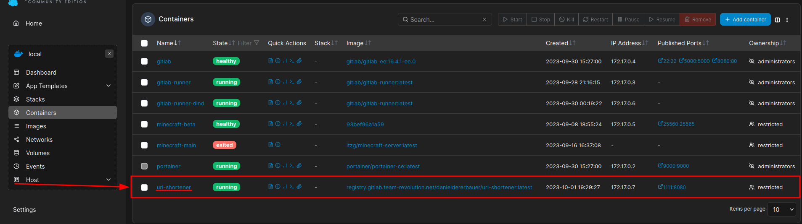
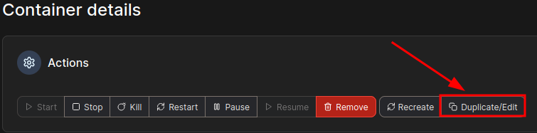
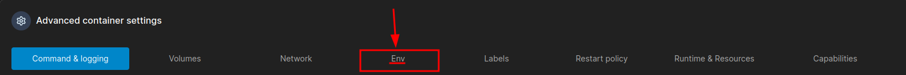
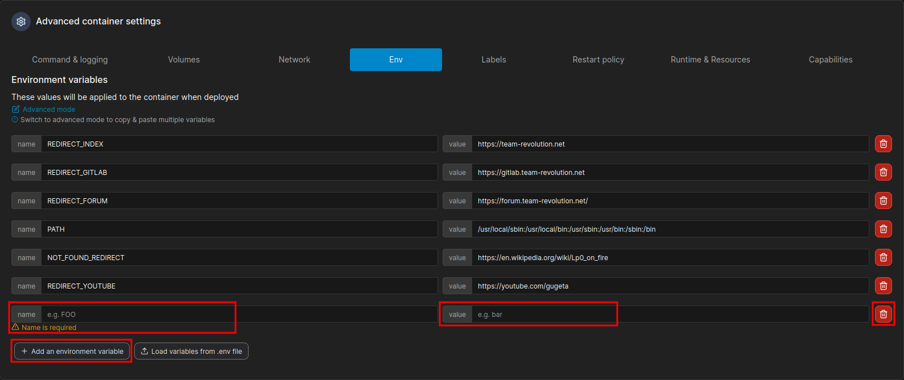

# Portainer Guide für URL Shortener

Um Änderungen am URL Shortener in Portainer vorzunehmen, muss folgendes getan werden:

1. Im Container Menü von Portainer auf dem Namen des Containers (`url-shortener`) klicken, um auf die Konfigurationsseite des Containers zu gelangen.

2. Anschließend auf den Button "Duplicate/Edit" klicken, um den Container zu editieren.

3. Zum Ende der Seite scrollen und unter "Advanced container settings" auf "Env" klicken.

4. Nun können die Änderungen vorgenommen werden. 
   1. Um eine neue Weiterleitung zu erstellen, auf den Button "Add an environment variable" klicken und in Feldern "name" und "value" dem README entsprechend die Werte eingeben.
   2. Um eine Weiterleitung zu ändern, einfach die Felder "name" oder "value" editieren.
   3. Um eine Weiterleitung zu löschen, auf den roten Mülleimer klicken.

5. Schließlich auf den Button "Deploy the container" (oberhalb des "Advanced container settings" Bereichs) und im sich öffnenden Pop-up-Fenster auf "Replace" klicken, um die Änderungen anzuwenden.